# SimpleNursing → HubSpot Enrichment Pipeline

> **Welcome, Ms. John.** This README is your complete guide. Read it once top-to-bottom before touching any code. Every decision, every API, every bug we hit — it's all documented here. By the end, you'll be able to run this entire pipeline yourself.

<br>

## Table of Contents

| # | Section |
|---|---|
| 1 | [What This Project Does](#1-what-this-project-does) |
| 2 | [Why We Built It](#2-why-we-built-it) |
| 3 | [Full Architecture](#3-full-architecture) |
| 4 | [Phase 1 Workflow — Step by Step](#4-phase-1-workflow--step-by-step) |
| 5 | [Local Setup](#5-local-setup) |
| 6 | [Understanding the Data File](#6-understanding-the-data-file) |
| 7 | [HubSpot Setup](#7-hubspot-setup) |
| 8 | [Run the Pipeline](#8-run-the-pipeline) |
| 9 | [HubSpot Properties Reference](#9-hubspot-properties-reference) |
| 10 | [CSV → HubSpot Mapping](#10-csv--hubspot-mapping) |
| 11 | [APIs — Full Reference](#11-apis--full-reference) |
| 12 | [Phase 2 — S3 at Scale](#12-phase-2--s3-at-scale) |
| 13 | [Troubleshooting](#13-troubleshooting) |
| 14 | [People & Contacts](#14-people--contacts) |

---

<br>

## 1. What This Project Does

Before this project, HubSpot had basic contact info for nursing customers — name, email, phone. **That's it.**

Marketing could not answer questions like:
- Which nurses have a license expiring in the next 60 days?
- Who has already renewed? (Don't send them a renewal campaign!)
- Who has an active membership? (Don't sell them membership they already have)
- Which nurses are Psychiatric specialists vs. Pediatric?

**After this project**, every nursing contact in HubSpot has **51 enriched custom properties** covering:

```
License data     → number, state, issued date, renewal date
CE status        → credits required, completed, CE period end
Membership       → tier, status, start/end dates, billing cadence
Purchase history → what they bought, order amount, payment status
Direct mail      → what mailers they received, which campaign
LMS engagement   → which courses, completion status, credits earned
Specialty        → Psychiatric, Pediatric, Family, etc. (from web)
NPI number       → National Provider Identifier (their unique nurse ID)
```

This enables the marketing team to build **segmented campaigns** — the right message to the right nurse at the right time.

---

<br>

## 2. Why We Built It

In a meeting between **Sam Chaudhary** (GTM Engineering), **Madhankumar Pillay** (Product), **Prabhu** (Senior Leadership), **Veena Anantharam** (Data Architecture), **Sandesh Segu** (Data Engineering), and **Aliza John** (you), the goal was:

> *"End this quarter with HubSpot having the full view of the SimpleNursing database record so marketing can do proper segmentation and targeted campaigns."*

The customer data lives in **Colibri's Redshift data warehouse**, exported to **AWS S3** as flat CSV files.

**Key architecture decision made in the meeting:**

> Veena: *"My preference would be a file-based integration. It's not going to be performant if you go the individual API route. We're talking about 17 million records."*

So we use **S3 files → Python → HubSpot API**. No direct database connection. File-based only.

---

<br>

## 3. Full Architecture

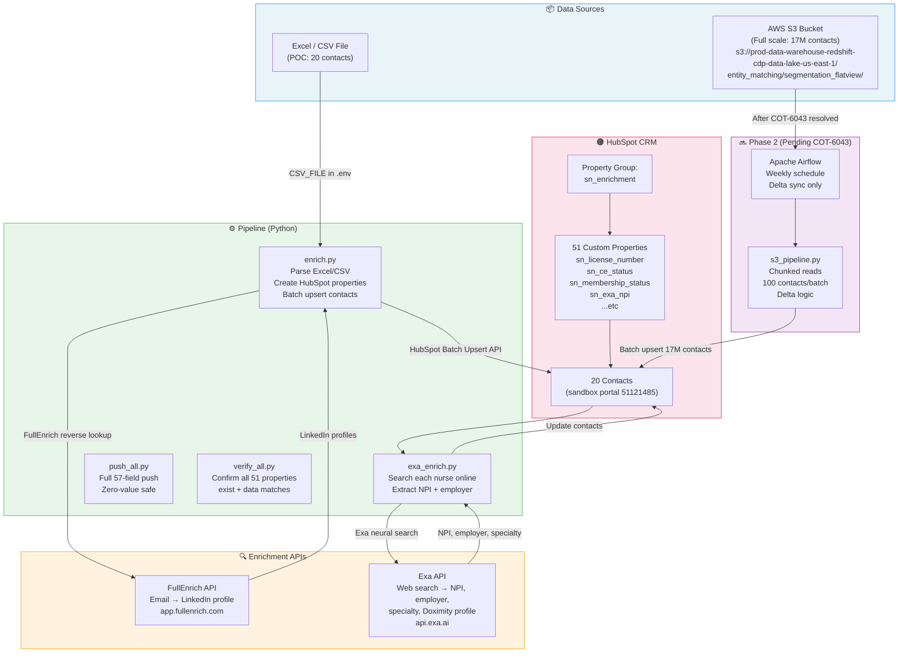

<br>

### Data Flow Summary

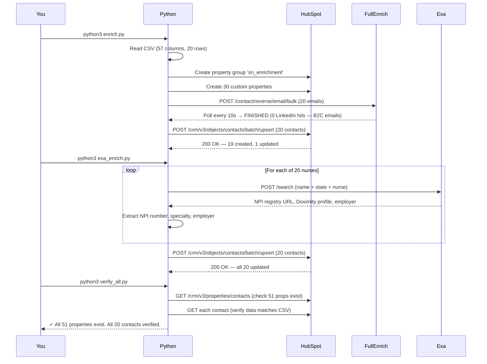

---

<br>

## 4. Phase 1 Workflow — Step by Step

```mermaid
flowchart LR
    A([🗂️ Start:\nGet CSV file\nfrom Sam]) --> B

    subgraph SETUP["Step 1 — Setup"]
        B["git clone repo"]
        B --> C["uv venv --python 3.11\nsource .venv/bin/activate"]
        C --> D["uv pip install -r requirements.txt"]
        D --> E["cp .env.example .env\nFill in 4 API keys + CSV path"]
    end

    subgraph HUBSPOT_SETUP["Step 2 — HubSpot"]
        F["Create HubSpot Private App\n(Settings → Integrations → Private Apps)"]
        G["Enable required scopes:\ncrm.objects.contacts.write\ncrm.schemas.contacts.write"]
        F --> G
    end

    subgraph RUN["Step 3 — Run Pipeline"]
        H["python3 enrich.py --dry-run\n✓ Validate without writing"]
        H --> I["python3 enrich.py\n✓ Create 30 properties\n✓ Upsert 20 contacts"]
        I --> J["python3 push_all.py\n✓ Push all 57 fields\n✓ Zero-value safe"]
        J --> K["python3 exa_enrich.py\n✓ NPI + employer + specialty\nvia Exa web search"]
    end

    subgraph VERIFY["Step 4 — Verify"]
        L["python3 verify_all.py\n✓ 51 properties in schema\n✓ 20 contacts data matches"]
        M["python3 build_csv.py\n✓ Adds HubSpot property row\n✓ Adds hs_id column"]
    end

    E --> F
    G --> H
    K --> L
    L --> M
    M --> N([✅ Done!\nHubSpot sandbox\nfully enriched])

    style SETUP fill:#e3f2fd,stroke:#1976D2
    style HUBSPOT_SETUP fill:#fff8e1,stroke:#F9A825
    style RUN fill:#e8f5e9,stroke:#388E3C
    style VERIFY fill:#fce4ec,stroke:#C2185B
```

---

<br>

## 5. Local Setup

### Prerequisites

| Tool | Why needed | Install |
|---|---|---|
| Python 3.11+ | Run all pipeline scripts | [python.org](https://python.org) |
| `uv` | Fast Python package manager | `curl -LsSf https://astral.sh/uv/install.sh \| sh` |
| Git | Clone the repo | [git-scm.com](https://git-scm.com) |

### Clone and Install

```bash
# 1. Clone
git clone https://github.com/samcolibri/simplenursing-hubspot-enrichment.git
cd simplenursing-hubspot-enrichment

# 2. Create virtual environment (Python 3.11 specifically)
uv venv --python 3.11
source .venv/bin/activate        # Mac / Linux
# .venv\Scripts\activate         # Windows

# 3. Install dependencies
uv pip install -r requirements.txt

# 4. Verify it worked
python3 -c "import openpyxl, requests; print('✓ Dependencies OK')"
```

### Configure Your `.env`

```bash
cp .env.example .env
```

Open `.env` and fill in these 4 values:

```dotenv
HUBSPOT_API_KEY=pat-na1-...          # from HubSpot Private App
FULLENRICH_API_KEY=xxxxxxxx-...      # from app.fullenrich.com
EXA_API_KEY=xxxxxxxx-...             # from exa.ai
CSV_FILE=/Users/yourname/Downloads/HC_CE_Renewal_Nursing_Specialty_3(Nursing_Flat_File).csv
```

> ⚠️ **Never commit `.env`** — it contains secrets. It's already in `.gitignore`. Never remove it.

### Where to get each key

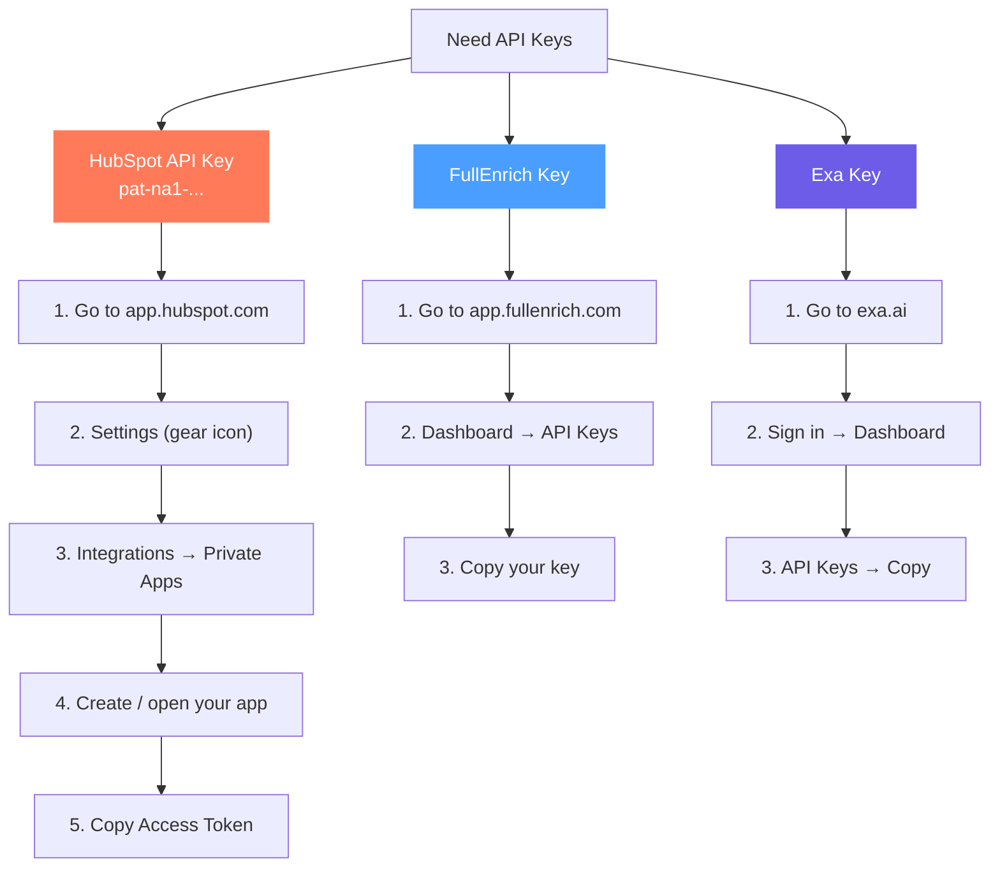

---

<br>

## 6. Understanding the Data File

The source file is: **`HC_CE_Renewal_Nursing_Specialty_3(Nursing_Flat_File).csv`**

> 📌 This file is **not in the repo** — it contains customer PII (personal identifiable information). Ask Sam Chaudhary for a copy.

### File Structure

The file has an unusual **3-row header** (most CSVs have 1):

```
Row 1  →  Section names       PERSON | | | | PERSON SOURCE | | LICENSE | ...
Row 2  →  CSV field names     resolved_person_id | person_name | person_email | ...
Row 3  →  HubSpot prop names  sn_person_id | firstname + lastname | email | ...  ← we added this
Row 4+ →  Actual data         4001877 | Annmarie Shoemaker | ANNMARIE@... | ...
```

### The 9 Data Sections

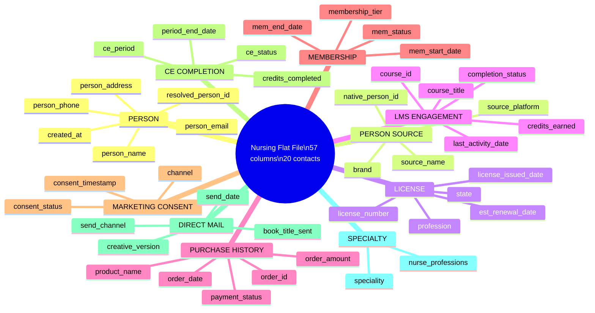

---

<br>

## 7. HubSpot Setup

### Creating a Private App (one-time setup)

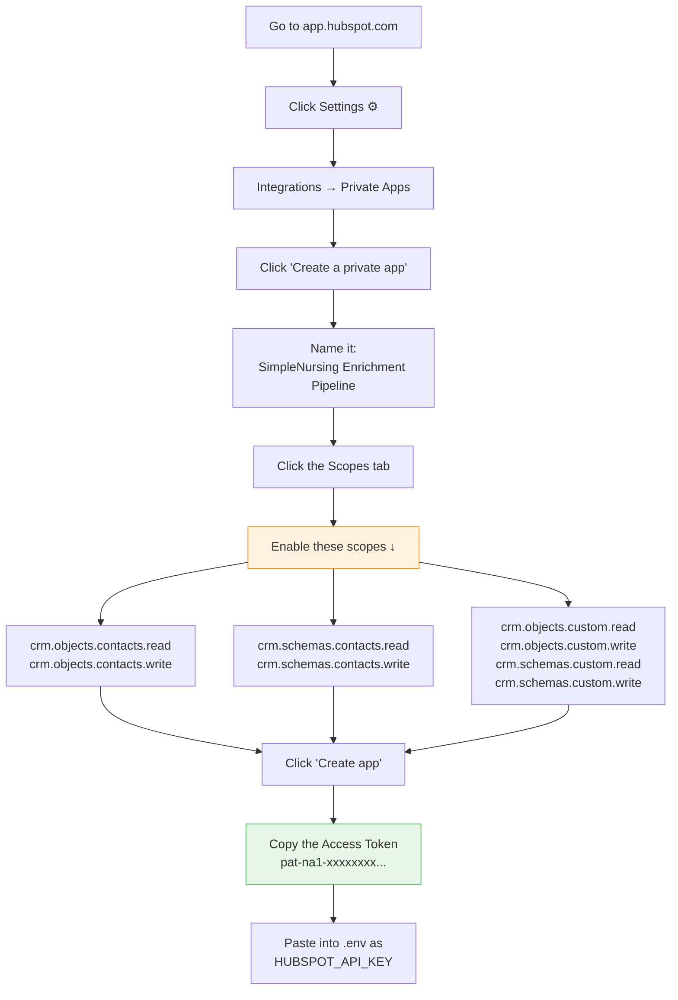

### Sandbox vs Production

| | Sandbox | Production |
|---|---|---|
| **Portal ID** | `51121485` | Different ID |
| **Used for** | Testing (our POC is here) | Real marketing contacts |
| **Risk** | None — safe to experiment | High — real customers |
| **Status** | ✅ Our 20 contacts are here | ⏳ Next phase |

To check which portal your token connects to:
```bash
curl -s "https://api.hubapi.com/integrations/v1/me" \
  -H "Authorization: Bearer $HUBSPOT_API_KEY" | python3 -m json.tool
# Look for "portalId" and "accountType" in the output
```

### How to See Custom Properties in HubSpot UI

After running the pipeline, custom properties won't show automatically. Here's how to view them:

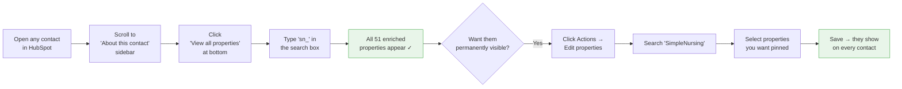

---

<br>

## 8. Run the Pipeline

### The Scripts and What They Do

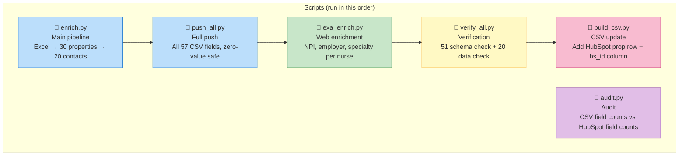

### Step-by-Step Commands

```bash
# ── Step 1: Dry run (validates everything, writes nothing) ──────────────────
python3 enrich.py --dry-run --skip-fullenrich
# Expected: 20 contacts validated, 0 errors

# ── Step 2: Live run — creates properties and upserts contacts ──────────────
python3 enrich.py --skip-fullenrich
# Expected: 30 properties created, 20 contacts upserted ✓

# ── Step 3: Push ALL 57 fields (handles zero values correctly) ──────────────
python3 push_all.py
# Expected: 0 new properties (already exist), 20 contacts updated ✓

# ── Step 4: Exa enrichment — NPI, employer, specialty ──────────────────────
python3 exa_enrich.py
# Expected: 20/20 contacts enriched, 6 new Exa properties added ✓

# ── Step 5: Verify everything landed correctly ──────────────────────────────
python3 verify_all.py
# Expected: ✓ All 51 properties exist. ✓ All 20 contacts verified.

# ── Step 6: Update CSV with HubSpot property names + HubSpot IDs ────────────
python3 build_csv.py
# Expected: CSV updated with row 3 (HubSpot props) + hubspot_id last column ✓
```

### What Good Output Looks Like

```
==========================================================
  SimpleNursing HubSpot Enrichment Pipeline
  Mode: LIVE
==========================================================

[13:38:14] Loaded 20 records
[13:38:14] FullEnrich: skipped (--skip-fullenrich)
[13:38:14] Setting up HubSpot properties...
[13:38:15] Property group 'sn_enrichment' already exists
[13:38:15] Properties: 30 created, 0 already existed
[13:38:15]
Upserting 20 contacts (batch mode)...
[13:38:17]   ✓ annmarieshoemaker@yahoo.com (created)
[13:38:17]   ✓ rghanson58@gmail.com (created)
[13:38:17]   ✓ debdawson@ymail.com (created)
...
==========================================================
  RESULTS
==========================================================
  Total records   : 20
  Upserted ok     : 20    ← must be 20
  Errors          : 0     ← must be 0
  FullEnrich hits : 0     ← OK (personal emails, B2C)
==========================================================
```

---

<br>

## 9. HubSpot Properties Reference

All 51 properties live in a group called `sn_enrichment` (label: **SimpleNursing Enrichment**).

### Property Type Reference

| HubSpot Type | What it means | Example |
|---|---|---|
| `string` | Plain text | `"RN628427"` |
| `number` | Numeric value | `39.0` |
| `date` | Epoch milliseconds at midnight UTC | `1749686400000` |
| `enumeration` | Dropdown with fixed options | `"Active"` / `"Expired"` |

> ⚠️ **Critical gotcha on dates:** HubSpot date fields do NOT accept `"2026-06-12"`. They require epoch milliseconds. Convert like this:
> ```python
> import calendar
> from datetime import datetime
> d = datetime(2026, 6, 12)
> epoch_ms = int(calendar.timegm(d.timetuple()) * 1000)  # → 1749686400000
> ```

### All 51 Properties by Section

```mermaid
flowchart TD
    GROUP["sn_enrichment\nProperty Group"]

    GROUP --> P1 & P2 & P3 & P4 & P5 & P6 & P7 & P8 & P9 & P10

    subgraph P1["👤 PERSON SOURCE (6)"]
        direction LR
        p1a["sn_person_id"] & p1b["sn_native_id"] & p1c["sn_brand"]
        p1d["sn_source_name"] & p1e["sn_source_platform"] & p1f["sn_created_at"]
    end

    subgraph P2["🪪 LICENSE (6)"]
        direction LR
        p2a["sn_license_id"] & p2b["sn_license_number"] & p2c["sn_license_state"]
        p2d["sn_profession"] & p2e["sn_license_issued_date"] & p2f["sn_est_renewal_date"]
    end

    subgraph P3["📚 LMS ENGAGEMENT (6)"]
        direction LR
        p3a["sn_course_id"] & p3b["sn_course_title"] & p3c["sn_lms_completion_status"]
        p3d["sn_credits_earned"] & p3e["sn_last_activity_date"] & p3f["sn_lms_source"]
    end

    subgraph P4["🛒 PURCHASE HISTORY (7)"]
        direction LR
        p4a["sn_order_id"] & p4b["sn_product_name"] & p4c["sn_product_category"]
        p4d["sn_order_amount"] & p4e["sn_order_date"] & p4f["sn_payment_status"] & p4g["sn_purchase_source"]
    end

    subgraph P5["💳 MEMBERSHIP (6)"]
        direction LR
        p5a["sn_membership_status\n(Active/Expired/Cancelled)"] & p5b["sn_membership_tier"] & p5c["sn_membership_cadence"]
        p5d["sn_mem_brand"] & p5e["sn_mem_start_date"] & p5f["sn_mem_end_date"]
    end

    subgraph P6["📬 MARKETING CONSENT (4)"]
        direction LR
        p6a["sn_channel"] & p6b["sn_consent_status\n(Opt-In/Opt-Out)"]
        p6c["sn_consent_brand"] & p6d["sn_consent_timestamp"]
    end

    subgraph P7["🎓 CE COMPLETION (4)"]
        direction LR
        p7a["sn_ce_period"] & p7b["sn_credits_completed"]
        p7c["sn_ce_status\n(Not Started/In Progress/Complete)"] & p7d["sn_ce_period_end_date"]
    end

    subgraph P8["📮 DIRECT MAIL (6)"]
        direction LR
        p8a["sn_send_channel"] & p8b["sn_send_brand"] & p8c["sn_send_date"]
        p8d["sn_creative_version"] & p8e["sn_book_title_sent"] & p8f["sn_book_sent_date"]
    end

    subgraph P9["🔍 EXA ENRICHMENT (6)"]
        direction LR
        p9a["sn_exa_employer"] & p9b["sn_exa_specialty"] & p9c["sn_exa_npi"]
        p9d["sn_exa_profile_url"] & p9e["sn_exa_profile_type"] & p9f["sn_exa_enriched_at"]
    end

    subgraph P10["🕐 META (1)"]
        p10a["sn_enriched_at"]
    end

    style GROUP fill:#E91E63,color:#fff,stroke:#C2185B
    style P1 fill:#e3f2fd,stroke:#1976D2
    style P2 fill:#e8f5e9,stroke:#388E3C
    style P3 fill:#fff8e1,stroke:#F9A825
    style P4 fill:#fce4ec,stroke:#C2185B
    style P5 fill:#f3e5f5,stroke:#7B1FA2
    style P6 fill:#e0f2f1,stroke:#00796B
    style P7 fill:#fff3e0,stroke:#E65100
    style P8 fill:#fafafa,stroke:#616161
    style P9 fill:#e8eaf6,stroke:#3949AB
    style P10 fill:#efebe9,stroke:#5D4037
```

> These properties also cross-map to existing standard HubSpot fields:
> - `sn_license_number` → also writes `license_number`
> - `sn_est_renewal_date` → also writes `education_renewal_date_us_nurses`
> - `sn_mem_end_date` → also writes `membership_end_date`
> - `sn_license_state` → also writes `license_state_abbreviation`

---

<br>

## 10. CSV → HubSpot Mapping

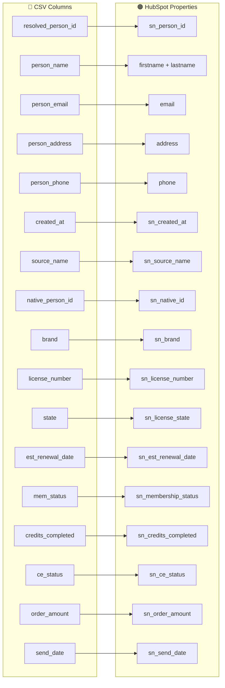

### Full Mapping Table

| Section | CSV Column | HubSpot Property | Type | Notes |
|---|---|---|---|---|
| PERSON | `resolved_person_id` | `sn_person_id` | string | |
| PERSON | `person_name` | `firstname` + `lastname` | string | Split on last space |
| PERSON | `person_email` | `email` | string | Lowercased |
| PERSON | `person_address` | `address` | string | |
| PERSON | `person_phone` | `phone` | string | |
| PERSON | `created_at` | `sn_created_at` | date | → epoch ms |
| PERSON SOURCE | `source_name` | `sn_source_name` | string | |
| PERSON SOURCE | `source_platform` | `sn_source_platform` | string | e.g. NetSuite |
| PERSON SOURCE | `native_person_id` | `sn_native_id` | string | e.g. CUS5089562 |
| PERSON SOURCE | `brand` | `sn_brand` | string | e.g. Elite |
| LICENSE | `resolved_license_id` | `sn_license_id` | string | |
| LICENSE | `license_number` | `sn_license_number` + `license_number` | string | dual-write |
| LICENSE | `state` | `sn_license_state` + `license_state_abbreviation` | string | dual-write |
| LICENSE | `profession` | `sn_profession` | string | |
| LICENSE | `license_issued_date` | `sn_license_issued_date` | date | → epoch ms |
| LICENSE | `est_renewal_date` | `sn_est_renewal_date` + `education_renewal_date_us_nurses` | date | dual-write |
| LMS | `course_id` | `sn_course_id` | string | |
| LMS | `course_title` | `sn_course_title` | string | |
| LMS | `completion_status` | `sn_lms_completion_status` | string | |
| LMS | `credits_earned` | `sn_credits_earned` | number | ⚠️ 0 is valid |
| LMS | `last_activity_date` | `sn_last_activity_date` | date | → epoch ms |
| LMS | `lms_source` | `sn_lms_source` | string | |
| PURCHASE | `order_id` | `sn_order_id` | string | |
| PURCHASE | `product_name` | `sn_product_name` | string | |
| PURCHASE | `product_category` | `sn_product_category` | string | |
| PURCHASE | `order_amount` | `sn_order_amount` | number | ⚠️ 0 is valid |
| PURCHASE | `order_date` | `sn_order_date` | date | → epoch ms |
| PURCHASE | `payment_status` | `sn_payment_status` | string | |
| PURCHASE | `purchase_source` | `sn_purchase_source` | string | |
| MEMBERSHIP | `membership_billing_cadence` | `sn_membership_cadence` | string | |
| MEMBERSHIP | `membership_tier` | `sn_membership_tier` | string | |
| MEMBERSHIP | `mem_brand` | `sn_mem_brand` | string | |
| MEMBERSHIP | `mem_start_date` | `sn_mem_start_date` | date | → epoch ms |
| MEMBERSHIP | `mem_end_date` | `sn_mem_end_date` + `membership_end_date` | date | dual-write |
| MEMBERSHIP | `mem_status` | `sn_membership_status` | enum | Active/Expired/Cancelled |
| CONSENT | `channel` | `sn_channel` | string | |
| CONSENT | `consent_status` | `sn_consent_status` | enum | Opt-In/Opt-Out |
| CONSENT | `consent_brand` | `sn_consent_brand` | string | |
| CONSENT | `consent_timestamp` | `sn_consent_timestamp` | date | → epoch ms |
| CE | `ce_period` | `sn_ce_period` | string | |
| CE | `credits_completed` | `sn_credits_completed` | number | ⚠️ 0 is valid |
| CE | `ce_status` | `sn_ce_status` | enum | Not Started/In Progress/Complete |
| CE | `period_end_date` | `sn_ce_period_end_date` | date | → epoch ms |
| DIRECT MAIL | `send_channel` | `sn_send_channel` | string | |
| DIRECT MAIL | `send_brand` | `sn_send_brand` | string | |
| DIRECT MAIL | `send_date` | `sn_send_date` | date | → epoch ms |
| DIRECT MAIL | `creative_version` | `sn_creative_version` | string | |
| DIRECT MAIL | `book_title_sent` | `sn_book_title_sent` | string | |
| DIRECT MAIL | `book_sent_date` | `sn_book_sent_date` | date | → epoch ms |
| SPECIALTY | `speciality` | `sn_specialty` | string | No data in POC |
| SPECIALTY | `nurse_professions` | `sn_nurse_professions` | string | No data in POC |

---

<br>

## 11. APIs — Full Reference

### HubSpot API

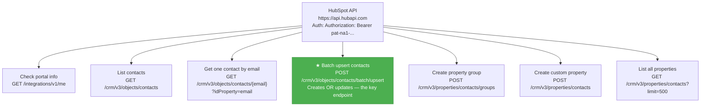

**Batch upsert — the most important API call:**

```python
response = requests.post(
    "https://api.hubapi.com/crm/v3/objects/contacts/batch/upsert",
    headers={"Authorization": "Bearer pat-na1-...", "Content-Type": "application/json"},
    json={
        "inputs": [
            {
                "id": "jane@example.com",      # match on this value
                "idProperty": "email",          # match using this field
                "properties": {                 # set all these fields
                    "email": "jane@example.com",
                    "firstname": "Jane",
                    "sn_license_number": "RN123456",
                    "sn_ce_status": "In Progress",
                    "sn_order_amount": 99.99
                }
            }
            # up to 100 contacts per call
        ]
    }
)
# 200 = success. Check response["results"] for individual outcomes.
```

**Create a property:**

```python
requests.post(
    "https://api.hubapi.com/crm/v3/properties/contacts",
    headers={"Authorization": "Bearer pat-na1-..."},
    json={
        "name": "sn_license_number",
        "label": "SN: License Number",
        "type": "string",           # string | number | date | enumeration
        "fieldType": "text",        # text | number | date | select
        "groupName": "sn_enrichment"
    }
)
```

---

### FullEnrich API

**What it does:** Give it emails → it finds their LinkedIn profiles.
**Why 0 hits for us:** Our nurses use personal emails (Yahoo, Gmail, Hotmail). FullEnrich works for corporate emails like `jane@hospital.com`.

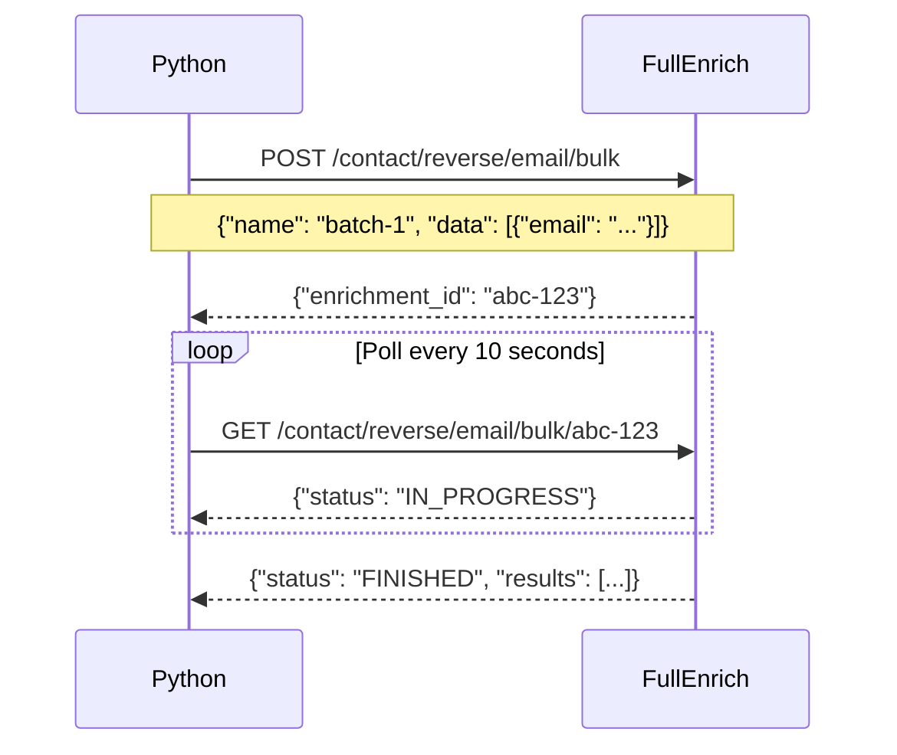

---

### Exa API

**What it does:** Semantic web search — finds nurses by name+state across LinkedIn, Doximity, NPI registries.
**Cost:** ~$0.007 per search. 20 nurses = $0.14.

```python
response = requests.post(
    "https://api.exa.ai/search",
    headers={"x-api-key": "your-exa-key"},
    json={
        "query": "Deborah Lynn Dawson registered nurse Texas",
        "num_results": 5,
        "type": "neural",
        "include_domains": [
            "linkedin.com",
            "doximity.com",
            "opennpi.com",       # NPI registry with employer data
            "opengovus.com",     # Government license records
            "npino.com"          # NPI with specialty info
        ],
        "contents": {"text": {"max_characters": 800}}
    }
)

# Each result has: title, url, score (0-1), text (extracted content)
# We parse the text for: NPI number, employer name, specialty keywords
```

**What we found for our 20 nurses:**

| Nurse | Found |
|---|---|
| Deborah Dawson | NPI `1972630978` · Specialty: **Psychiatric** |
| Renee Hanson | **LinkedIn profile** · Employer: Halifax Health Medical Center |
| Tina King-Pemberton | NPI `1013330109` · **Family NP** specialty |
| Corazon Barcelona | NPI + **Acute Care** + LinkedIn |
| Tosha Vaughn | NPI + **Pediatric** specialty |
| Shawn Taylor | NPI + **Home Health** specialty |

---

<br>

## 12. Phase 2 — S3 at Scale

### Current Status

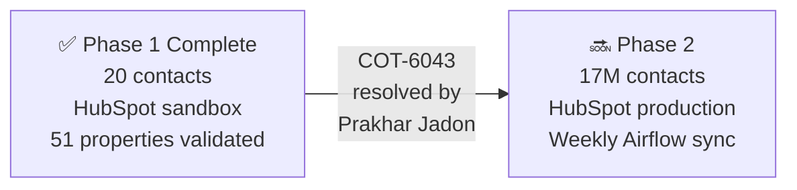

### The Jira Ticket

| Field | Value |
|---|---|
| **Ticket** | [COT-6043](https://colibrigroup.atlassian.net/browse/COT-6043) |
| **Assigned to** | Prakhar Jadon |
| **Watching** | Austin Ellingwood |
| **Priority** | Critical |
| **Initiative** | 375 — Build Segments/Audiences leveraging Data Warehouse |

DevOps will provide `AWS_ACCESS_KEY_ID`, `AWS_SECRET_ACCESS_KEY` via 1Password. Set them in `.env`.

### S3 Path

```
Bucket:  prod-data-warehouse-redshift-cdp-data-lake-us-east-1
Prefix:  entity_matching/segmentation_flatview/
File:    hc_ce_renewal_segmentation_flatview_000.csv
Region:  us-east-1
```

### Phase 2 Architecture

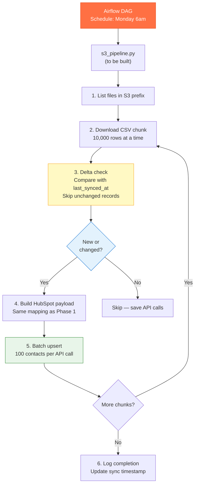

**Why delta sync?** At 17M records, pushing everything every time would:
- Take ~47 hours at 100 contacts/second
- Cost significant HubSpot API quota
- Be wasteful — most records don't change week-to-week

Delta sync = only push records where something changed since last run.

---

<br>

## 13. Troubleshooting

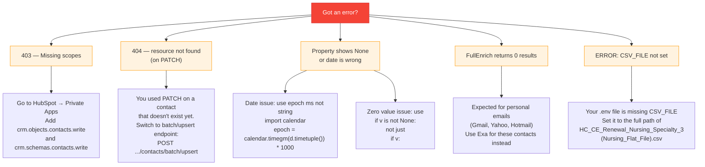

---

<br>

## 14. People & Contacts

| Name | Role | Email |
|---|---|---|
| **Sam Chaudhary** | GTM Engineering — project lead | sam.chaudhary@colibrigroup.com |
| **Aliza John** | Intern — that's you! | — |
| **Madhankumar Pillay** | Product owner | — |
| **Prabhu** | Senior leadership | — |
| **Veena Anantharam** | Data architecture | — |
| **Sandesh Segu** | Data engineering | — |
| **Prakhar Jadon** | DevOps — S3 access (COT-6043) | — |
| **Austin Ellingwood** | DevOps — cc on COT-6043 | — |

---

<br>

## Quick Reference Card

| What | Command |
|---|---|
| Dry run (safe test) | `python3 enrich.py --dry-run --skip-fullenrich` |
| Push contacts | `python3 enrich.py --skip-fullenrich` |
| Push all 57 fields | `python3 push_all.py` |
| Web enrichment | `python3 exa_enrich.py` |
| Verify everything | `python3 verify_all.py` |
| Update CSV | `python3 build_csv.py` |
| Audit field counts | `python3 audit.py` |
| Check portal info | `curl -s https://api.hubapi.com/integrations/v1/me -H "Authorization: Bearer $HUBSPOT_API_KEY"` |

---

<br>

> *Built by Sam Chaudhary with Claude Code.*
> *Questions? Open an issue on this repo or email sam.chaudhary@colibrigroup.com*
